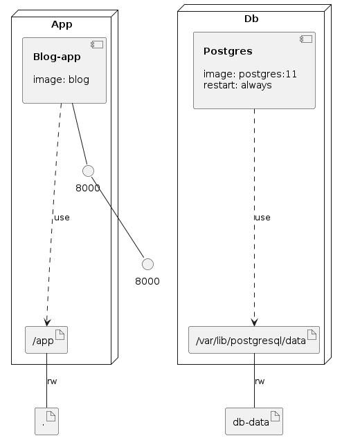

# plantilla django docker-compose

Esta es una plantilla para armar proyectos usando:

- Python 3.9
- Pipenv
- Postgresql
- Django 3.1
- django-environ
- django-crispy-forms
- django-bootstrap4
- django-fontawesome-5

Y se despliega en docker-compose.

# Uso

Antes de empezar configurar el archivo .env, el archivo .env-sample contiene un ejemplo, luego:

    $ docker-compose up --build
    
Se incluye una aplicación simple (e incompleta) de gestión de posts en un blog.

# Atención

Esta app configura un usuario admin por default usando el mecanismo disponible en Django, ver en el archivo `runserver.sh` la llamada a `python manage.py createsuperuser`, esta se debe modificar para crear un usuario distinto a admin y cambiar el email.
    
#  Licencia

Uso libre, django y los otros elementos usados en este proyecto tienen sus respectivas licencias.

2019-2021 Eduardo Díaz

    
    

### Infrastructure model

